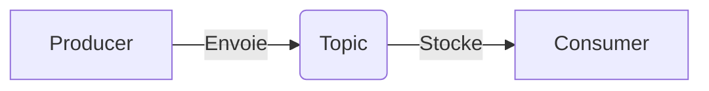

# Chapitre 1 : Apache Kafka et le concept de Streaming
**Copyright par Pascale Nancy Alia AKPO**

Dans ce chapitre, nous allons découvrir comment envoyer et recevoir des données en temps réel. C'est la base des projets de détection de fraude, de NLP en temps réel ou de monitoring.

---

## 1. Batch vs Streaming : Quelle différence ?

Avant d'utiliser Kafka, il faut comprendre pourquoi on l'utilise.
- **Le traitement par lots (Batch) :** On collecte les données pendant une période (une journée, une semaine), on les stocke, puis on les traite d'un coup.
  - *Exemple :* Calculer le chiffre d'affaires à la fin de la journée.
- **Le traitement en flux (Streaming) :** Chaque donnée est traitée dès qu'elle est générée, sans attendre.
  - *Exemple :* Détecter une fraude sur une carte bancaire au moment précis de l'achat.

---

## 2. Qu'est-ce que Apache Kafka ?

Kafka est une plateforme de streaming distribuée. C'est une sorte de système de messagerie ultra-rapide capable de gérer des millions de messages par seconde.
Il permet de connecter des applications qui produisent des données avec des applications qui les analysent.

---

## 3. Les Concepts Clés de Kafka

Pour comprendre Kafka, il faut maîtriser 4 mots de vocabulaire :



- **Le Topic (Sujet) :** C'est une catégorie ou un nom de dossier où les messages sont stockés. 
  - *Exemple :* Un topic `transactions` pour la banque, ou `tweets` pour le NLP.
- **Le Producer (Producteur) :** L'application qui envoie des messages dans un Topic.
  - *Exemple :* L'application mobile qui envoie une transaction.
- **Le Consumer (Consommateur) :** L'application qui lit les messages depuis un Topic pour les traiter.
  - *Exemple :* Le moteur de détection de fraude.
- **Le Broker (Serveur) :** Le serveur physique (ou virtuel) sur lequel tourne Kafka. Un cluster Kafka contient plusieurs Brokers.

---

## 4. Partitions et Offsets (Sous le capot)

Chaque **Topic** est divisé en **Partitions**.
- Les partitions permettent de répartir les données sur plusieurs serveurs pour aller plus vite.
- Chaque message dans une partition reçoit un numéro unique et séquentiel appelé **Offset** (index). Un message ne peut jamais être modifié, on ajoute toujours à la fin.

---

## 5. Exemple Pratique en Python

Voici comment créer un producteur et un consommateur simples en Python avec la bibliothèque `kafka-python`.

### Le Producteur (Producer)
Il envoie un message toutes les secondes dans le topic `cours-topic`.

```python
# Import de la bibliothèque Kafka
from kafka import KafkaProducer
import time

# Connexion au serveur Kafka local
producer = KafkaProducer(bootstrap_servers=['localhost:9092'])

print("Démarrage du producteur...")

# Envoi de 5 messages de test
for i in range(5):
    message = f"Message numéro {i}"
    # Envoi du message converti en octets (bytes)
    producer.send('cours-topic', value=message.encode('utf-8'))
    print(f"Envoyé : {message}")
    time.sleep(1) # Attente d'une seconde

# Fermeture propre du producteur
producer.close()
```

### Le Consommateur (Consumer)
Il écoute le topic `cours-topic` et affiche les messages reçus.

```python
# Import de la bibliothèque Kafka
from kafka import KafkaConsumer

# Connexion et abonnement au topic 'cours-topic'
consumer = KafkaConsumer(
    'cours-topic',
    bootstrap_servers=['localhost:9092'],
    auto_offset_reset='earliest' # Lit depuis le début s'il n'y a pas d'historique
)

print("Démarrage du consommateur. En attente de messages...")

# Boucle infinie pour lire les messages en temps réel
for message in consumer:
    # Décodage du message reçu
    texte = message.value.decode('utf-8')
    print(f"Reçu : {texte} (depuis la partition {message.partition})")
```

---

## 6. Exercice de validation

Pour valider ce chapitre, réponds aux questions suivantes :
1. Si tu développes un système de recommandation de films en temps réel (comme Netflix), quel composant envoie l'historique des clics de l'utilisateur à Kafka ? (Le Producer ou le Consumer ?)
2. Comment appelle-t-1 l'identifiant (index numérique) qui indique la position d'un message dans une partition Kafka ?

*Une fois que tu as lu le cours et que tu as tes réponses, écris-les moi. Nous passerons ensuite au Chapitre 2.*
