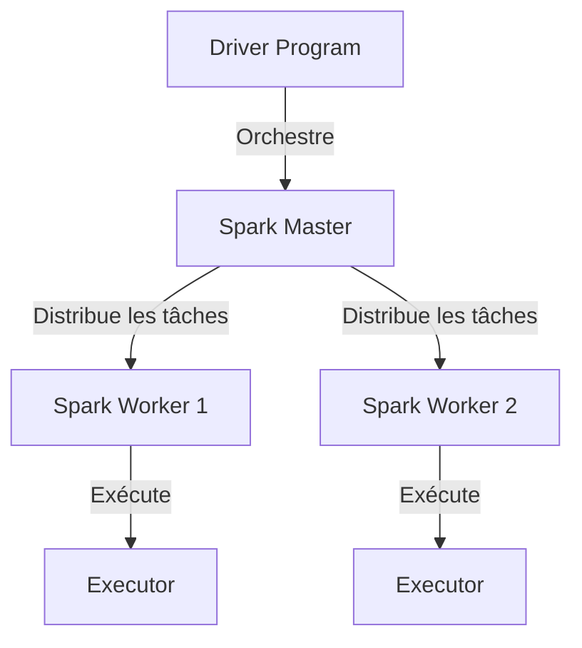

# Chapitre 3 : Introduction à Apache Spark et PySpark
**Copyright par Pascale Nancy Alia AKPO**

Dans ce chapitre, nous allons voir comment fonctionne le moteur de calcul Big Data le plus populaire du marché : Apache Spark. C'est le cœur de l'analyse dans tous nos projets.

---

## 1. Pourquoi Apache Spark ?

Avant Spark, on utilisait **Hadoop MapReduce**. Mais MapReduce écrivait tous ses résultats intermédiaires sur le disque dur, ce qui le rendait très lent.
- **La révolution Spark :** Il effectue tous ses calculs **en mémoire RAM**. Il est donc jusqu'à 100 fois plus rapide que Hadoop MapReduce.
- Il est conçu pour traiter des données distribuées (réparties sur plusieurs serveurs).

---

## 2. L'architecture de Spark (Master - Worker)

Spark fonctionne sur un modèle Master-Slave (Maître-Esclave) :



- **Driver Program :** Ton script Python (le code). C'est lui qui crée le plan d'action.
- **Spark Master :** Le chef d'orchestre. Il alloue les ressources et distribue le travail.
- **Spark Workers & Executors :** Les machines qui font le vrai travail de calcul et stockent les données en RAM.

---

## 3. RDD vs DataFrames

Spark possède deux structures de données principales :
1.  **RDD (Resilient Distributed Dataset) :** L'ancienne API. C'est une collection de données brutes répartie sur les machines. Très flexible mais compliquée à optimiser.
2.  **DataFrame :** L'API moderne (que nous utilisons). C'est comme une table SQL ou un DataFrame Pandas, structuré en colonnes avec un schéma bien défini. Elle est optimisée automatiquement par Spark.

---

## 4. Manipulation de données avec PySpark (Exemple pratique)

Voici comment lire un fichier CSV local avec Spark, le filtrer et calculer des agrégations.

```python
# Import de la session Spark
from pyspark.sql import SparkSession
from pyspark.sql.functions import col, avg

# Initialisation de la session Spark
spark = SparkSession.builder \
    .appName("Introduction_PySpark") \
    .getOrCreate()

# Lecture d'un fichier CSV contenant des données de ventes
df = spark.read.csv("ventes.csv", header=True, inferSchema=True)

# 1. Afficher le schéma des données (les types de colonnes)
df.printSchema()

# 2. Filtrer les ventes supérieures à 100€
ventes_elevees = df.filter(col("montant") > 100)

# 3. Calculer la moyenne des ventes par catégorie de produit
moyenne_par_categorie = df.groupBy("categorie").agg(avg("montant").alias("montant_moyen"))

# 4. Afficher les résultats sur l'écran
moyenne_par_categorie.show()

# Fermeture de la session Spark
spark.stop()
```

---

## 5. Mini Exercice (Avec Solution)

### Énoncé
Dans le cadre du projet E-commerce, tu as un DataFrame contenant des transactions avec les colonnes `customer_id`, `amount` et `country`. Écris le code PySpark pour trouver les 5 clients ayant dépensé le plus d'argent au total.

### Solution
```python
from pyspark.sql import SparkSession
from pyspark.sql.functions import col, sum as spark_sum

# Initialisation Spark
spark = SparkSession.builder.appName("Exercice_Top_Clients").getOrCreate()

# Chargement fictif des données
df = spark.read.csv("ecommerce_data.csv", header=True, inferSchema=True)

# Résolution :
# 1. Grouper par ID Client
# 2. Sommer le montant dépensé
# 3. Trier par ordre décroissant
# 4. Prendre les 5 premiers
top_clients = df.groupBy("customer_id") \
    .agg(spark_sum("amount").alias("total_depense")) \
    .orderBy(col("total_depense").desc()) \
    .limit(5)

top_clients.show()
spark.stop()
```

---

## 6. Vidéos et ressources complémentaires
- 🎥 **YouTube :** "PySpark Tutorial for Beginners" (Chaîne : *FreeCodeCamp*).
- 🎥 **YouTube :** "Apache Spark Architecture Explained" (Chaîne : *Defog Tech*).
