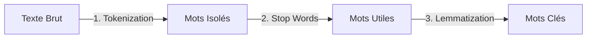

# Chapitre 6 : Le Traitement du Langage Naturel (NLP) pour l'analyse de sentiment
**Copyright par Pascale Nancy Alia AKPO**

Ce chapitre présente les bases du traitement automatique des données textuelles. C'est la base de l'exercice 2 : l'analyse de sentiment sur les réseaux sociaux (comme Twitter/X).

---

## 1. Qu'est-ce que le NLP (Natural Language Processing) ?

Le NLP regroupe l'ensemble des techniques permettant aux ordinateurs de lire, comprendre et interpréter le langage humain (le texte ou la parole).
Dans le Big Data, le NLP permet d'automatiser l'analyse de millions d'avis clients ou de messages publiés chaque seconde sur les réseaux sociaux.

---

## 2. Le pipeline de nettoyage du texte

Avant d'analyser le sentiment d'une phrase (Positif, Négatif ou Neutre), il faut nettoyer le texte brut :



1.  **La Tokenisation :** Découper une phrase en mots individuels (les "tokens").
    *   *Exemple :* `"J'adore Spark"` devient `["J'", "adore", "Spark"]`.
2.  **La suppression des Stop Words (Mots vides) :** Retirer les mots qui n'apportent aucun sens (ex: "le", "la", "de", "un").
    *   *Exemple :* `["un", "excellent", "produit"]` devient `["excellent", "produit"]`.
3.  **La Lemmatisation (ou Racinisation) :** Ramener les mots à leur forme de base (le dictionnaire ou le radical).
    *   *Exemple :* `"mangeait"`, `"mangent"` deviennent `"manger"`.

---

## 3. Exemple pratique : Analyse de sentiment simple en Python

Pour faire du NLP simple en Python, on utilise souvent la bibliothèque `TextBlob` ou `nltk`. Voici un exemple pour calculer la polarité d'une phrase (positif/négatif).

```python
# Import de TextBlob pour l'analyse de texte
from textblob import TextBlob

# Phrases de test
phrases = [
    "Ce produit est absolument fantastique et marche super bien !", # Positif
    "C'est la pire expérience de ma vie, le service client est nul." # Négatif
]

for phrase in phrases:
    # Analyse de la phrase
    analysis = TextBlob(phrase)
    # polarité varie entre -1.0 (très négatif) et 1.0 (très positif)
    polarite = analysis.sentiment.polarity
    
    if polarite > 0:
        sentiment = "Positif"
    elif polarite < 0:
        sentiment = "Négatif"
    else:
        sentiment = "Neutre"
        
    print(f"Phrase : '{phrase}' -> Sentiment : {sentiment} (Score : {polarite})")
```

---

## 4. Mini Exercice (Avec Solution)

### Énoncé
Dans le cadre de l'exercice 2 (Satisfaction client sur les réseaux sociaux), tu as un DataFrame avec une colonne `message` contenant des commentaires d'utilisateurs. Écris une fonction Python simple qui prend une liste de commentaires, calcule leur sentiment, et retourne le pourcentage de commentaires négatifs pour alerter l'équipe marketing.

### Solution
```python
from textblob import TextBlob

def calculer_taux_insatisfaction(commentaires):
    total = len(commentaires)
    negatifs = 0
    
    for comm in commentaires:
        # Analyse avec TextBlob
        blob = TextBlob(comm)
        # Si le score de polarité est inférieur à 0, c'est négatif
        if blob.sentiment.polarity < 0:
            negatifs += 1
            
    # Calcul du pourcentage de négatifs
    taux_negatif = (negatifs / total) * 100
    return taux_negatif

# Test de la fonction
avis_clients = [
    "J'adore mon nouveau téléphone.",
    "C'est vraiment trop lent et nul.",
    "Bof, pas terrible la qualité.",
    "Excellent service, je recommande."
]

taux = calculer_taux_insatisfaction(avis_clients)
print(f"Taux de clients mécontents : {taux}%")
```

---

## 5. Vidéos et ressources complémentaires
- 🎥 **YouTube :** "Natural Language Processing (NLP) Tutorial" (Chaîne : *Edureka*).
- 🎥 **YouTube :** "Text Classification & Sentiment Analysis" (Chaîne : *Python Engineer*).
