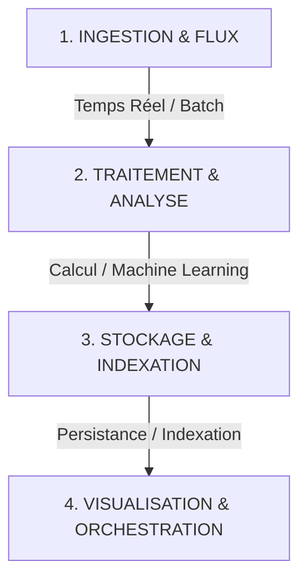

# Plan Global d'Apprentissage : Architecture Big Data & Streaming
**Copyright par Pascale Nancy Alia AKPO**

Ce document présente la structure du cours complet. L'objectif est de te donner toutes les clés pour comprendre, concevoir et coder n'importe lequel des 8 projets Big Data du programme (fraude, NLP, AIOps, prévision de demande, trafic urbain, recommandation, APM, etc.).

---

## 1. Les 4 Piliers du Big Data & Streaming

Tous les exercices de ton cours reposent sur les mêmes 4 piliers technologiques. Comprendre ces piliers permet de résoudre n'importe quel sujet :

1.  **Ingestion & Flux (Streaming) :** Comment collecter les données (logs, transactions, tweets) et les envoyer en continu sans perte.
    *   *Outils :* **Apache Kafka**, APIs, Filebeat.
2.  **Traitement & Analyse :** Comment nettoyer, agréger et analyser des millions de données en temps réel.
    *   *Outils :* **Apache Spark** (PySpark, Structured Streaming).
3.  **Stockage & Indexation (Data Lake / DB) :** Où stocker ces données pour qu'elles restent accessibles rapidement.
    *   *Outils :* **Hadoop HDFS**, **Elasticsearch**, **PostgreSQL**, AWS S3.
4.  **Visualisation & Orchestration :** Comment afficher les résultats sur un écran et automatiser les tâches.
    *   *Outils :* **Grafana**, **Apache Airflow**.

---

## 2. Programme des Chapitres du Cours

Voici la liste des chapitres que nous allons étudier un par un. À la fin de chaque chapitre, nous ferons un exercice pratique simple pour valider tes connaissances.

### 📚 Module A : Le Streaming & l'Ingestion
*   **Chapitre 1 :** Apache Kafka et le concept de Streaming (Producers, Consumers, Topics).
*   **Chapitre 2 :** L'ingestion de sources diverses (Fichiers, APIs, Agents comme Filebeat).

### 📚 Module B : Le Traitement Distribué
*   **Chapitre 3 :** Introduction à Apache Spark (DataFrames, RDD, architecture distribuée).
*   **Chapitre 4 :** Spark Structured Streaming (Traiter les données au fil de l'eau).

### 📚 Module C : Le Machine Learning à grande échelle
*   **Chapitre 5 :** La détection d'anomalies et de fraudes (Modèles non-supervisés : Isolation Forest, K-Means).
*   **Chapitre 6 :** Le Traitement du Langage Naturel (NLP) pour l'analyse de sentiment.
*   **Chapitre 7 :** Les moteurs de recommandation (Filtrage collaboratif avec ALS) et la prévision de séries temporelles (Ventes).

### 📚 Module D : Stockage, Visualisation & Orchestration
*   **Chapitre 8 :** Indexer et stocker les données (Elasticsearch vs PostgreSQL vs Hadoop HDFS).
*   **Chapitre 9 :** Créer des dashboards temps réel avec Grafana et orchestrer les flux avec Apache Airflow.

---
*Si ce programme te convient, dis-le moi. Nous commencerons immédiatement par le **Chapitre 1 : Apache Kafka et le concept de Streaming**.*
