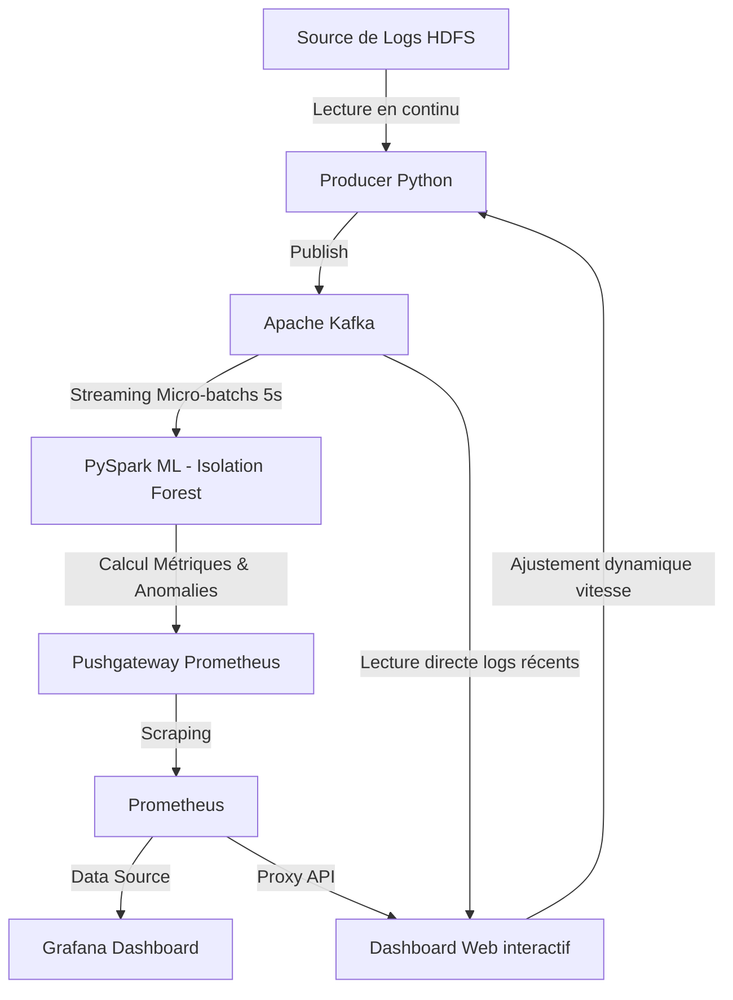

# Rapport d'Analyse : Détection d'anomalies dans les performances applicatives (APM)
**Copyright par Pascale Nancy Alia AKPO**

## 1. Introduction
Ce projet répond à la problématique métier de la détection automatique des anomalies de performance applicative. L'objectif est de surveiller en temps réel un système en s'appuyant sur l'analyse de logs HDFS, en simulant un environnement de streaming.

## 2. Architecture Globale du Pipeline
L'architecture est entièrement conteneurisée via Docker pour garantir la portabilité et la facilité de déploiement. Elle intègre désormais les composants suivants :



- **Producer (Python)** : Télécharge le dataset HDFS_2k.log et simule un flux temps réel. Il adapte son rythme d'envoi en interrogeant l'API du Dashboard Web.
- **Message Broker (Kafka & Zookeeper)** : Assure le découplage asynchrone entre la production et le traitement analytique.
- **Analyse Machine Learning (Spark Structured Streaming)** : Consomme le flux depuis Kafka. Calcule des caractéristiques clés (volume, longueur moyenne) par fenêtre glissante et applique l'algorithme **Isolation Forest** (scikit-learn) pour évaluer un score d'anomalie en continu.
- **Metrics Push (Prometheus Pushgateway)** : Spark transmet les métriques (volume, score, alerte) au Pushgateway.
- **Stockage & Visualisation Standard (Prometheus & Grafana)** : Prometheus collecte les métriques. Grafana propose des tableaux de bord interactifs intégrant des couleurs adaptées, des seuils de scores et un lien d'accès au dashboard personnalisé.
- **Dashboard Web Interactif (Flask/HTML/CSS/JS)** : Une interface moderne sur le port `8080` permettant la personnalisation complète (thèmes visuels, réglage de seuil d'anomalie en direct, masquage de panels et contrôle de la simulation de charge).

---

## 3. Personnalisation & Amélioration des Dashboards

Pour répondre à la demande d'amélioration et de choix des éléments du dashboard ("choisir des trucs, les dashboards, les couleurs et tout"), le système propose deux solutions complémentaires :

### A. Le Dashboard Interactif Premium (Port 8080)
Cette interface conçue en Vanilla HTML/CSS/JS avec un style "glassmorphism" intègre plusieurs fonctionnalités avancées :
1. **Sélecteur de Thèmes de Couleurs** : L'utilisateur peut changer de thème visuel en temps réel avec mise à jour immédiate des variables CSS :
   - *Cyberpunk Néon* : Tons sombres avec bleu et rose fluorescents.
   - *Vert Émeraude* : Ambiance épurée verte et dorée.
   - *Bleu Minuit Glass* : Transparence floutée sur fond bleu nuit profond.
   - *Dracula Sombre* : Couleurs classiques de développement (violet, gris, rose).
   - *Sunset Orange* : Tons chauds orange et brique.
2. **Curseur de Seuil d'Anomalie dynamique** : Permet d'ajuster le niveau de tolérance du ML. Le graphique trace dynamiquement une ligne en pointillés rouges représentant le seuil. Si le score de l'application descend en dessous de ce seuil, une alerte visuelle (clignotement rouge de l'interface) est instantanément levée.
3. **Contrôle de Simulation** : Un bouton Pause/Lecture et un curseur de vitesse d'envoi permettent de faire varier le flux. Réduire le délai d'envoi simule instantanément un pic de charge, forçant le modèle ML à détecter une anomalie (explosion du volume).
4. **Sélection de Panels** : Des cases à cocher permettent d'afficher ou de masquer des panels du dashboard (volume, score, terminal, statut global) pour épurer l'interface à la volée.
5. **Console de Logs HDFS en Direct** : Un terminal intégré affiche le flux de logs bruts consommés depuis Kafka, avec coloration syntaxique automatique selon la sévérité (WARN, ERROR, INFO).

### B. Optimisation du Dashboard Grafana (Port 3000)
- **Lien Direct intégré** : Un bouton de raccourci a été ajouté dans le menu supérieur de Grafana pour basculer facilement vers le Dashboard Interactif en un clic.
- **Correction des Seuils** : Les seuils de la courbe du score d'anomalie ML ont été corrigés pour afficher le vert (comportement stable) pour les scores supérieurs à -0.15 et le rouge (comportement anormal) pour les scores inférieurs.
- **Code Couleurs Harmonisé** : Utilisation de palettes de couleurs cyan et violettes fixes pour une meilleure cohérence esthétique lors de la présentation.

---

## 4. Instructions de lancement et d'utilisation
1. Ouvrez Docker Desktop.
2. Démarrez l'infrastructure avec BuildKit désactivé pour éviter les erreurs de compilation liées aux accents du chemin d'accès Windows :
   ```powershell
   $env:DOCKER_BUILDKIT=0
   docker-compose up -d --build
   ```
3. Accédez aux interfaces :
   - **Dashboard Interactif (Recommandé pour la démo)** : `http://localhost:8080`
   - **Grafana** : `http://localhost:3000` (login: `admin`, password: `admin`)
   - **Prometheus** : `http://localhost:9090`
4. Pendant votre soutenance, utilisez le bouton **Simuler une Anomalie** (en diminuant le délai d'envoi de logs dans le dashboard à `0.01s`) pour observer le pic de charge et le déclenchement de l'alerte rouge.
